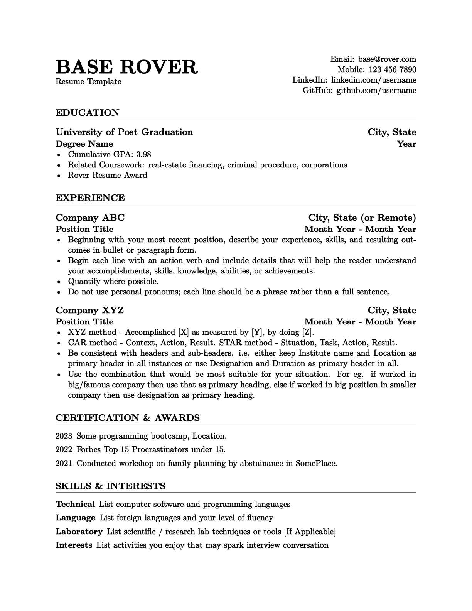

# Rover Resume Template

## Overview

The **Rover Resume** template is a LaTeX-based document that provides a clean and organized format for creating a professional resume. This template is designed with simplicity and typographic design principles in mind. It uses basic LaTeX commands and popular packages- keeping it very easy to follow and customise while retaining its visual appeal. 

## Sample Output

*Sample Resume Output.*

## Features

- Clean and professional design.
- Easy-to-use LaTeX template.
- Organized sections for Education, Experience, Certifications, Projects, and Skills.
- Utilizes modern fonts for improved readability.
- Customizable headers for personal information.

## Usage

1. Clone or download the Rover Resume template.
2. Copy the [template](https://github.com/subidit/rover-resume/blob/main/rover-template.tex) to a new Overleaf project. Or Open the [LaTeX template file](https://github.com/subidit/rover-resume/blob/main/rover-template.tex) in your preferred editor.
3. Fill in your personal information, including name, contact details, and links to LinkedIn and GitHub.
4. Populate the sections for Education, Experience, Certifications & Awards, and Skills & Interests with your relevant information.
5. Customize the formatting, such as fonts and spacing, to match your preferences.

## Customization

- Adjust fonts, spacing, and formatting according to your preferences.
- Personalize section headers and sub-headers to better suit your resume content.

## Contact

For inquiries or support, use the discussion tab.

Feel free to contribute to the project or provide feedback by opening an issue or submitting a pull request.

Happy job hunting!

## License
[CC0 1.0 Universal](https://github.com/subidit/rover-resume/blob/main/LICENSE)
<!-- 
Simple résumé template which uses basic LaTeX with explainer comments. 

**Options for the `enumitem` Package:**

| Option         | Description                                      |
|----------------|--------------------------------------------------|
| `label`        | Customizes the label for the list items          |
| `leftmargin`   | Sets the left margin of the list                 |
| `itemsep`      | Adjusts the vertical spacing between items       |
| `parsep`       | Sets the space between paragraphs within items   |
| `topsep`       | Defines the space before and after the list      |
| `partopsep`    | Space before and after the list when it starts a new paragraph |
| `itemindent`   | Indentation of the item text                      |
| `listparindent` | Paragraph indentation within items (for descriptions) |
| `left`         | Adjusts the left margin (can be negative)        |
| `labelindent`  | Indentation of the label                          |
| `resume`       | Resumes numbering from the previous list         |
| `align`        | Adjusts the alignment of labels                   |
| `widest`       | Sets the widest label as the reference for indentation |
| `start`        | Specifies the start value for numbering          |
| `style`        | Defines the style of labels (e.g., 1, (a), i, etc.) |
| `ref`          | Provides reference to another list               |
| `before`       | Inserts content before the list                  |
| `after`        | Inserts content after the list                   |
| `*`            | Compact list style, no extra vertical spacing     |
| `!`            | Inline list style, no vertical spacing between items |

**Options for the `hyperref` Package:**

| Option           | Description                                  |
|------------------|----------------------------------------------|
| `colorlinks`     | Color links (true or false)                  |
| `linkcolor`      | Color for internal links                     |
| `citecolor`      | Color for citation links                     |
| `urlcolor`       | Color for URL links                          |
| `linkbordercolor` | Color of link borders                     |
| `pdfborder`      | Style of the link border                     |
| `linktoc`        | Table of contents link behavior              |
| `breaklinks`     | Allow links to break over multiple lines     |
| `hidelinks`      | Hide links (true or false)                   |
| `hypertexnames`  | Use guessable names for links                |
| `bookmarks`      | Add PDF bookmarks (true or false)            |
| `bookmarksopen`  | Open bookmarks on startup (true or false)    |
| `bookmarksnumbered` | Number the bookmarks (true or false)     |
| `pdfstartview`   | Initial view of PDF document                 |
| `pdfpagemode`    | Page view on opening the PDF                 |

**Options for the `titlesec` Package:**

| Option       | Description                                  |
|--------------|----------------------------------------------|
| `titleformat` | Customizes the format of section titles    |
| `titlelabel`  | Customizes the label of the section        |
| `titlespacing` | Adjusts the spacing around section titles  |
| `titleline`   | Draws a line under section titles            |
| `pagestyles`  | Customizes page headers and footers        |
| `newparttoc`  | Adds a table of contents for parts         |
| `appendix`    | Configuration for appendices                |
| `extramarks`  | Marks for page headers/footers             |
| `toctitles`   | Formatting of titles in the table of contents |

The `*` option in `enumitem` provides a compact list style, and the `!` option provides an inline list style, both without extra vertical spacing between items. These options are particularly useful for creating more compact lists.

The `hyperref` and `titlesec` packages have many options for customizing hyperlinks, PDF properties, section titles, and page headers and footers in documents. These tables provide a subset of the available options for reference.
